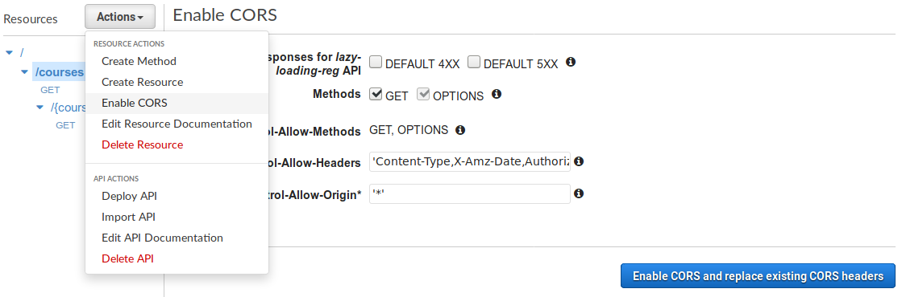
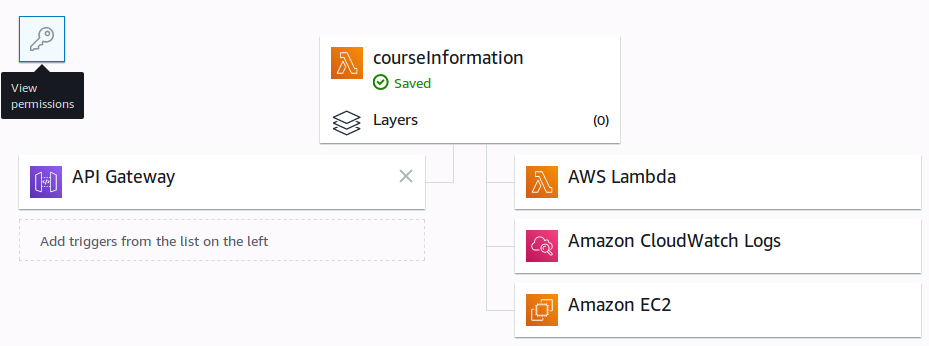

# Lazy Loading Reg

## Notes about VPC

It is possible to put Lambda instances into a VPC to access private services such as an ElastiCache instance.
Though this will create more overhead for Lambda and also require additional setups to access the internet through
a NAT gateway.

Please refer to these official guides for more details:
- [Tutorial: Configuring a Lambda Function to Access Amazon ElastiCache in an Amazon VPC](https://docs.aws.amazon.com/lambda/latest/dg/vpc-ec.html)
- [How can I grant internet access to my VPC Lambda function?](https://aws.amazon.com/premiumsupport/knowledge-center/internet-access-lambda-function/)

Alternatively, if the structure does not require a private network, the Lambda functions can just use no VPC.

## Project setup

Required: [Node.js](https://nodejs.org/).

1. Install dependencies.
  ```sh
    npm install
  ```

2. Zip the directory to be deployed with AWS Lambda.
  ```sh
  zip -r ../lazy-loading-reg.zip ./*
  ```

## Create Lambda functions

1. Create 2 new lambda functions (for 2 endpoints at `/courses` and `/courses/:course-number`).
  - Function names can be anything. For clarity, `courseList` and `courseInformation` are preferred and used in this example.
  - Node.js 8.10 runtime is preferred.

2. Upload the zip file to both functions. Set the following Handler names:
  - For `courseList`: `courseList.handler`.
  - For `courseInformation`: `courseInformation.handler`.

3. Set environment variables:

  Name | Default Value | Required | Description
  ---- | ------------- | --------- | -----------
  `CACHING` | `false` | no | If not set, caching will be disabled. Set to `memory` to use in-memory caching, and `redis` to use Redis backend.
  `CACHE_TTL` | `259200000` (3 days) | no | Cache TTL in milliseconds. Used for both in-memory cache and Redis.
  `CACHE_SIZE` | | no | Set a maximum number of entries for the cache before pruning expired entries. Only used for in-memory cache.
  `REDIS_URL` | | yes | The URL of the Redis server. Format: `[redis[s]:]//[[user][:password@]][host][:port][/db-number][?db=db-number[&password=bar[&option=value]]]`. See [Node Redis documentation](http://redis.js.org/#api-rediscreateclient) and [Redis URI Schemes at IANA](https://www.iana.org/assignments/uri-schemes/prov/redis) for more details. Only used for Redis.

4. Set execution role.
  - The role should have access to Lambda.
  - If using VPC, the role should also have VPC access.

5. Modify basic settings.
  - From testing, 256MB of allocated memory should be enough to function.
  - Set a moderately high timeout to account for Reg's response time, e.g., 1-2 minutes.

## Create API Gateway

1. Create a regional REST API by importing [swagger.json](docs/swagger.json).

2. Set integration for each endpoint.
  - At `/courses/GET`, set integration to the `courseList` Lambda function. Use Lambda Proxy integration.
  - At `/courses/{courseNumber}/GET`, set integration to the `courseInformation` Lambda function. Use Lambda Proxy integration.

3. For each resource, click Actions > Enable CORS > Enable CORS and replace existing CORS headers.



4. Deploy the API. Click Actions > Deploy API. Set the desired stage name.

## Configure Lambda functions

1. Add API Gateway as trigger for each Lambda function. Set security to open.

2. Permissions might need to be modified to properly allow access to `/courses` endpoint.
  (The default permissions allow `/courseList` endpoint instead. Genius.)
  - Click on Permissions.
  
  - Permissions will be shown in JSON. To properly execute the function, `AWS:SourceArn` needs to be
    set to `arn:aws:execute-api:region:id:api-id/*/GET/courses`.
    If the default permissions do not match, a new permission can be created with AWS CLI.
    ```sh
    aws lambda add-permission \
    --function-name courseList \
    --statement-id some-id \
    --action lambda:InvokeFunction \
    --principal apigateway.amazonaws.com \
    --source-arn arn:aws:execute-api:region:id:api-id/*/GET/courses
    ```
  - The same can be done with `/courses/:course-number` but the default permissions set by AWS probably work fine.
  - Refer to [the official tutorial](https://docs.aws.amazon.com/lambda/latest/dg/with-on-demand-https-example.html) for more information.

## Redis

A simple Redis instance can be used as a caching backend.
If Redis is open to public, always set a password to secure the data.

To use ElastiCache or a private Redis instance, see notes about VPC at the beginning of this document.
